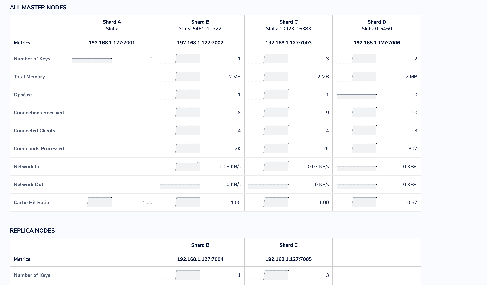

## 1. Сохранить большой JSON (~20МБ) в виде разных структур - строка, hset, zset, list;
Поднимем простую `redis` базу данных:
```bash
hw3-redis ) docker run -d --name redis-simple-server -p 6379:6379 redis:latest                                                                                                     (base) 
285556ab3c66b03fc27318fc17e7eca52a2ba4b9addcfe718ca555ddd0f1127d
hw3-redis ) docker ps                                                                                                                                                              (base) 
CONTAINER ID   IMAGE          COMMAND                  CREATED         STATUS         PORTS                    NAMES
285556ab3c66   redis:latest   "docker-entrypoint.s…"   3 seconds ago   Up 2 seconds   0.0.0.0:6379->6379/tcp   redis-simple-server
```

Сохраним большой JSON в виде строки с помощью скрипта `python` (исходник в файле `json.ipynb`):
```python
import json
import redis
import time

data = json.load(open('large-file.json'))
r = redis.StrictRedis(host='localhost', port=6379, db=0)

def flatten_dict(d, parent_key='', sep=':'):
    items = []
    for k, v in d.items():
        new_key = f"{parent_key}{sep}{k}" if parent_key else k
        if isinstance(v, dict):
            items.extend(flatten_dict(v, new_key, sep=sep).items())
        else:
            items.append((new_key, v))
    return dict(items)

def set_elem2redis(elem):
    fd = flatten_dict(elem)
    k = fd['id']

    for key, value in fd.items():
        if key == 'id':
            continue
        r.set(f"{k}:{key}", f"{value}")

start = time.time()
for elem in data:
    set_elem2redis(elem)
end = time.time()
print(f"Time: {end - start}")
```
```bash
Time: 58.72272205352783
```

проверим:
```bash
hw3-redis ) docker exec -it redis-simple-server redis-cli                                                                                                                          (base) 
127.0.0.1:6379> get 2489651045:actor:login
"petroav"
127.0.0.1:6379> get 2489651045:actor:id
"665991"
127.0.0.1:6379> 
```

Сохраним большой JSON в виде `hset`:
```python
def set_elem2redis_hset(elem):
    fd = flatten_dict(elem)
    k = fd['id']

    r.hset(k, mapping=fd)
```

<br>

Сохраним большой JSON в hset с помощью скрипта `python` (исходник в файле `json.ipynb`):
```python
def set_elem2redis_hset(elem):
    fd = flatten_dict(elem)
    k = fd.pop('id')
    for key, value in fd.items():
        fd[key] = str(value)
    r.hset(f"{k}", mapping=fd)

start = time.time()
for elem in data:
    set_elem2redis_hset(elem)
end = time.time()
print(f"Time: {end - start}")
```
```bash
Time: 2.5177500247955322
```
проверим:
```bash
127.0.0.1:6379> hget 2489651045 type
"CreateEvent"
127.0.0.1:6379> hget 2489651045 actor:id
"665991"
127.0.0.1:6379> 
```

<br>

Сохраним id и login субъекта из JSON в `zset`:
```python
ids_sorted = "ids_sorted"
for elem in data:
    r.zadd(ids_sorted, {elem['actor']['login'] : elem['actor']['id']})
```
```bash
Time: 1.419557809829712
```
проверим:
```bash
127.0.0.1:6379> zscore ids_sorted petroav
"665991"
127.0.0.1:6379> 
```

<br>

Сохраним id из большого JSON в list с помощью скрипта `python` (исходник в файле `json.ipynb`):
```python
ids_list = "ids"
for elem in data:
    r.lpush(ids_list, elem['id'])
```
```bash
Time: 1.7995710372924805
```
проверим:
```bash
127.0.0.1:6379> flushdb
OK
(0.53s)
127.0.0.1:6379> llen ids
(integer) 11351
127.0.0.1:6379> 
```
<br>
<br>

## 2. Протестировать скорость сохранения и чтения;
Скорость сохранения замерена в каждом из вариантов представления данных при сохранении. 
Замерим скорости чтения для каждого из вариантов:
```python
start = time.time()
for elem in data:
    r.hget(elem['id'], 'actor:id')
end = time.time()
print(f"Time: {end - start}")
```
```bash
Time: 1.6342508792877197
```

```python
start = time.time()
for elem in data:
    r.get(f"{elem['id']}:actor:id")
end = time.time()
print(f"Time: {end - start}")
```
```bash
Time: 1.423008918762207
```

```python
start = time.time()
for elem in data:
    r.zscore(ids_sorted, elem['actor']['login'])
end = time.time()
print(f"Time: {end - start}")
```
```bash
Time: 1.3145198822021484
```

```python
start = time.time()
for elem in data:
    r.lpop(ids_list)
end = time.time()
print(f"Time: {end - start}")
```
```bash
Time: 1.4005730152130127
```

<br>
<br>

## 3. Настроить редис кластер на 3х нодах с отказоустойчивостью, затюнить таймауты.

Кластер настраивал с помощью `Docker` на `macOS`. В нем нету поддержки сетевого драйвера, поэтому пришлось накинуть TCP-proxy на все узлы кластера с помощью `haproxy`. Его конфигурация описана в файле `haproxy.cfg`.

Минимальное количество узлов в кластере 6 = 3 мастера и 3 реплики. При этом у каждого мастера своя реплика, которая реплицирует с него данные.

Для тюнинга таймаутов использовался параметр `cluster-node-timeout 5000` миллисекунд в конфигурации `redis.conf`, формирование которого описано в скрипте `redis.sh`.

В файле `docker-compose.yaml` описываем контейнер для каждой из 6 нод кластера, контейнеры для `haproxy` (`redis-proxy`), `redis/insight`, а также контейнер `redis-cluster-creator`, который поднимает кластер и затем завершается.

Итого после запуска кластера у нас будут работать следующие контейнеры:
```bash
seredkings ) docker ps                                                   (base) 
CONTAINER ID   IMAGE                            COMMAND                  CREATED         STATUS         PORTS                                                                                                                                                                                                                                                                                                                    NAMES
30ece84855cc   redislabs/redisinsight:1.14.0    "bash ./docker-entry…"   9 minutes ago   Up 9 minutes   0.0.0.0:8001->8001/tcp                                                                                                                                                                                                                                                                                                   redis-insight
9d12dadbee63   haproxytech/haproxy-alpine:2.4   "/docker-entrypoint.…"   9 minutes ago   Up 9 minutes   0.0.0.0:8404->8404/tcp, 0.0.0.0:7001->9001/tcp, 0.0.0.0:7002->9002/tcp, 0.0.0.0:7003->9003/tcp, 0.0.0.0:7004->9004/tcp, 0.0.0.0:7005->9005/tcp, 0.0.0.0:7006->9006/tcp, 0.0.0.0:7101->9101/tcp, 0.0.0.0:7102->9102/tcp, 0.0.0.0:7103->9103/tcp, 0.0.0.0:7104->9104/tcp, 0.0.0.0:7105->9105/tcp, 0.0.0.0:7106->9106/tcp   hw3-redis-redis-proxy-1
5c570df90661   redis:7.2.3                      "docker-entrypoint.s…"   9 minutes ago   Up 9 minutes   6379/tcp                                                                                                                                                                                                                                                                                                                 hw3-redis-redis-node-4-1
72c6eb74ad06   redis:7.2.3                      "docker-entrypoint.s…"   9 minutes ago   Up 9 minutes   6379/tcp                                                                                                                                                                                                                                                                                                                 hw3-redis-redis-node-1-1
36aa7575b795   redis:7.2.3                      "docker-entrypoint.s…"   9 minutes ago   Up 9 minutes   6379/tcp                                                                                                                                                                                                                                                                                                                 hw3-redis-redis-node-2-1
1a76850caa36   redis:7.2.3                      "docker-entrypoint.s…"   9 minutes ago   Up 9 minutes   6379/tcp                                                                                                                                                                                                                                                                                                                 hw3-redis-redis-node-5-1
a55b468a96ab   redis:7.2.3                      "docker-entrypoint.s…"   9 minutes ago   Up 9 minutes   6379/tcp                                                                                                                                                                                                                                                                                                                 hw3-redis-redis-node-3-1
b3251799ec13   redis:7.2.3                      "docker-entrypoint.s…"   9 minutes ago   Up 9 minutes   6379/tcp                                                                                                                                                                                                                                                                                                                 hw3-redis-redis-node-6-1

```

После этого можно подключиться к кластеру по `redis-proxy:9001` через контейнер `redis-proxy-1` с помощью `redis/insights`.

Сделаем несколько записей в кластер:
```bash
Connecting...

Pinging Redis server on 192.168.1.127:7006...
Connected.
Ready to execute commands.
>> set a 1

-> Redirected to slot [15495] located at 192.168.1.127:7003
"OK"
>> set b 2

-> Redirected to slot [3300] located at 192.168.1.127:7001
"OK"
>> set c 3

-> Redirected to slot [7365] located at 192.168.1.127:7002
"OK"
>> set d 4

-> Redirected to slot [11298] located at 192.168.1.127:7003
"OK"
>> set e 5

"OK"
Connecting...

Pinging Redis server on 192.168.1.127:7004...
Connected.
Ready to execute commands.
>> set f 6

-> Redirected to slot [3168] located at 192.168.1.127:7001
"OK"
```

После этого на мастер ноде с портом `7001` у нас будут следующие записи: `{b: 2, f: 6}`, на мастер ноде с портом `7002` - `{c: 3}`, на мастер ноде с портом `7003` - `{a: 1, d: 4, e: 5}`. Соответственно на репликах будут храниться данные с мастер нод: на реплике с портом `7006` - `{b: 2, f: 6}`, на реплике с портом `7005` - `{c: 3}`, на реплике с портом `7004` - `{a: 1, d: 4, e: 5}`.

Убъем мастер ноду с портом `7001`:
```bash
seredkings ) docker stop hw3-redis-redis-node-1-1
hw3-redis-redis-node-1-1
```

В `redis/insights` видим следующую картину: 

<br>



<br>

Реплика с портом `7006` стала мастером и взяла на себя данные `{b: 2, f: 6}`. При этом реплика с портом `7005` стала репликой для нового мастера с портом `7003`, а реплика с портом `7004` стала репликой для нового мастера с портом `7002`.

