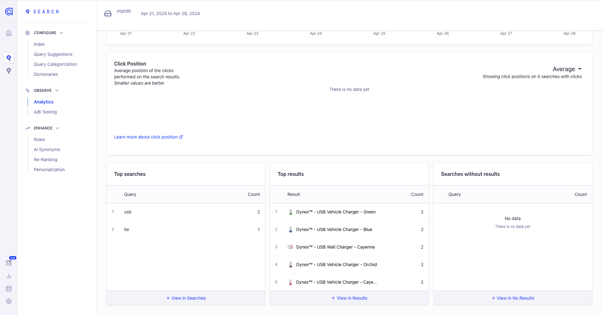
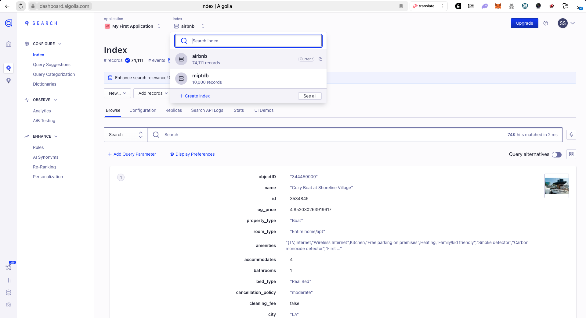

## Отчет
#### a. История развития СУБД
Основана в 2012 году, первоначально занималась оффлайн поиском для мобильных устройств, позже переквалифицировались на поиск в реальном времени.

В 2018 году приобрела SeaUrchin.IO, платформу для информированния о поисковых запросах в режиме реального времени.

В 2021 году в состав Algolia вошел румынский стартап MorphL, который специализируется на прогнозировании поведения потребителей на ecommerce-площадках.

За 9 раундов финансирования компания привлекла $334.3 млн.

<br>

#### b. Инструменты для взаимодействия с СУБД
REST API + библиотеки для популярных языков программирования: PHP, Ruby, Python, Java, .NET, Go, Swift, Kotlin...
Пример взаимодействия с БД с помощью библиотеки Python:
```python
# hello_algolia.py
from algoliasearch.search_client import SearchClient

# Connect and authenticate with your Algolia app
client = SearchClient.create("YourApplicationID", "YourWriteAPIKey")

# Create a new index and add a record
index = client.init_index("test_index")
record = {"objectID": 1, "name": "test_record"}
index.save_object(record).wait()

# Search the index and print the results
results = index.search("test_record")
print(results["hits"][0])
```
```
{'name': 'test_record', 'objectID': '1', '_highlightResult': ... }
```

<br>

#### c. Какой database engine используется в вашей СУБД?
Algolia использует собственный NoSQL движок. Он поддерживает индексацию и хранение журналов, причем операции индексации и поиска разделены на разные прикладные процессы с разными приоритетами планировния. Операции поиска имеют больший приоритет.

<br>

#### d. Как устроен язык запросов в вашей СУБД? Разверните БД с данными и выполните ряд запросов.
Запросы к БД отправляются в формате json, их можно отправлять разными способами, как и POST запросом, так и с помощью библиотек. Пример POST запроса через утилиту ```curl```:
```bash
curl -X POST \
     -H "X-Algolia-API-Key: ${API_KEY}" \
     -H "X-Algolia-Application-Id: ${APPLICATION_ID}" \
     --data-binary '{ "params": "query=george%20clo&hitsPerPage=2&getRankingInfo=1" }' \
     "https://${APPLICATION_ID}-dsn.algolia.net/1/indexes/imdb/query"
```
Тут мы в заголовке указываем ключ и ID нашего приложения, а в теле запроса передаем параметры поиска. В данном случае мы ищем фильмы, в названии которых есть "george clo", и выводим 2 результата, а также информацию о ранжировании.

Для демонстрации запроса через библиотеку Python я создал тестовую БД с записями о продуктах на маркетплейсе (10000 записей). Пример запроса:
```python
from algoliasearch.search_client import SearchClient

client = SearchClient.create("<APPLICATION_ID>", "<API_KEY>")

index = client.init_index("miptdb")

res = index.search("usb", {'attributesToRetrieve': ['name', 'url', 'salePrice']})['hits']
res.sort(key=lambda x: x['salePrice'])

for i in res[:5]:
    print(f"{i['name']} for {i['salePrice']}, link: {i['url']}")
```
```
Dynex™ - USB Optical Mouse - Black/Gray for 5.99, link: http://www.bestbuy.com/site/dynex-usb-optical-mouse-black-gray/7654041.p?id=1218857084849&skuId=7654041&cmp=RMX&ky=2d3GfEmNIzjA0vkzveHdZEBgpPCyMnLTJ
Dynex™ - USB Optical Mouse - Black for 7.99, link: http://www.bestbuy.com/site/dynex-usb-optical-mouse-black/7653088.p?id=1218857084837&skuId=7653088&cmp=RMX&ky=2d3GfEmNIzjA0vkzveHdZEBgpPCyMnLTJ
Dynex™ - USB Keyboard for 9.99, link: http://www.bestbuy.com/site/dynex-usb-keyboard/7656049.p?id=1218857084843&skuId=7656049&cmp=RMX&ky=2d3GfEmNIzjA0vkzveHdZEBgpPCyMnLTJ
Dynex™ - USB Wall Charger - Orchid for 9.99, link: http://www.bestbuy.com/site/dynex-usb-wall-charger-orchid/4155008.p?id=1219096726551&skuId=4155008&cmp=RMX&ky=2d3GfEmNIzjA0vkzveHdZEBgpPCyMnLTJ
Dynex™ - USB Wall Charger - Blue for 9.99, link: http://www.bestbuy.com/site/dynex-usb-wall-charger-blue/4154018.p?id=1219096727059&skuId=4154018&cmp=RMX&ky=2d3GfEmNIzjA0vkzveHdZEBgpPCyMnLTJ
```

Тут поисковый запрос ищет продукты, в названии которых есть "usb", и выводит 5 самых дешевых. Выводятся название, цена и ссылка на продукт. Запрос обработался за 1 милисекунду.


<br>

#### e. Распределение файлов БД по разным носителям?
У Algolia есть распределенное хранение данных на 3 сервера. На каждом сервере хранится полная копия данных, распределение нужно только для надежности -- на случай, если один из серверов Algolia выйдет из строя, другие будут отрабатывать запросы на поиск и индексацию. Algolia использует алгоритм консенсуса Raft для обеспечения согласованности данных между серверами. Все 3 сервера равнозначны. Algolia ставит доступность в приоритет над согласованностью -- в поисковых БД лучше гарантировать быстрый результат поиска, чем ждать согласованности, в случае выхода из строя одного из серверов.


<br>

#### f. На каком языке/ах программирования написана СУБД?
Явно свой стэк они не раскрывают, но в вакансиях на backend engineer основные требуемые языки программирования -- C++ и golang.


<br>

#### g. Какие типы индексов поддерживаются в БД? Приведите пример создания индексов.
Algolia поддерживает следующие типы аттрибутов в своих записях: `string`, `integer`, `float`, `boolean`, `object`, `array`. Algolia индексирует аттрибуты, по которым будет вестись поиск (по умолчанию все, можно указать конкретные). Как конкретно она их индексирует не раскрывает. В документации Algolia слово `index` является синонимом `table` или `collection`, отдельно создавать индексы не нужно, индексируются все записи автоматически.
```python
import pandas as pd
airbnb = pd.read_csv('Airbnb_Data.csv')
airbnb.fillna("NaN", inplace=True)
airbnb_index = client.init_index("airbnb")
airbnb_index.save_objects(airbnb.to_dict(orient='records'), {'autoGenerateObjectIDIfNotExist': True})
```


<br>

#### h. Как строится процесс выполнения запросов в вашей СУБД?
1. Идентификация по API ключу и ID приложения.
2. Выбор индекса, к которому обращаемся.
3. Отправка запроса в формате json.

<br>

#### i. Есть ли для вашей СУБД понятие «план запросов»? Если да, объясните, как работает данный этап.
Нет, Algolia это NoSQL база данных.

<br>

#### j. Поддерживаются ли транзакции в вашей СУБД? Если да, то расскажите о нем. Если нет, то существует ли альтернатива?
Нет, в них нет необходимости в задачах быстрого нечеткого поиска. Альтернатива транзакциям в Algolia [batch](https://www.algolia.com/doc/api-reference/api-methods/batch/), который позволяет отправлять несколько операций индексации в одном запросе. Это позволяет уменьшить количество запросов к серверу (тем самым повысить производительность) и обеспечить целостность данных, все операции внутри батча будут выполнены атомарно.

<br>

#### k. Какие методы восстановления поддерживаются в вашей СУБД. Расскажите о них.
Данные распределяются на 3 сервера, согласованность данных обеспечивается алгоритмом RAFT, это позволяет восстанавливать данные при утрате их одним или двумя из серверов.

<br>

#### l. Расскажите про шардинг в вашей конкретной СУБД. Какие типы используются? Принцип работы.
Algolia не разделяет данные на шарды, полная копия данных хранится на каждом из 3 серверов. Первостепенная цель Algolia в надежности, пропускная способность и так высокая, одного сервера для хранения данных Algolia для своих задач считает достаточным.

<br>

#### m. Возможно ли применить термины Data Mining, Data Warehousing и OLAP в вашей СУБД?
Algolia решает в первую очередь задачу быстрого поиска по индексированным данным. Она не предназначена для хранения и представления сырых, необработанных данных для последующего анализа. Простой юзкейс использования -- реализация поиска товаров на меркетплейсах. Algolia предоставляет аналитику по запросам, но она сводная, верхнеуровневая. В итоге эти термина не применимы к Algolia.



<br>

#### n. Какие методы защиты поддерживаются вашей СУБД? Шифрование трафика, модели авторизации и т.п.
Авторизация по API ключу, шифрование трафика (POST запрос по протоколу `https`). Все запросы логируются и могут быть просмотрены в консоли. Также можно ограничить видимость некоторых аттрибутов для разных пользователей / групп пользователей.

<br>

#### o. Какие сообщества развивают данную СУБД? Кто в проекте имеет права на коммит и создание дистрибутива версий? Расскажите об этих людей и/или компаниях.
Основную работу по развитию Algolia ведет команда разработчиков Algolia. Сообщество может развивать дополнительные плагины, API, исходный код которых расположен на [GitHub](https://github.com/algolia), например, библиотека для `python` расположена [тут](https://github.com/algolia/algoliasearch-client-python). В этом репозитории основной контрибьютор -- [nunomaduro](https://github.com/nunomaduro). Он также контрибьютил библиотеку [openai-php/client](https://github.com/openai-php/client), является core разработчиком [Laravel](https://github.com/laravel) веб фреймворка.

<br>

#### p. Создайте свои собственные данные для демонстрации работы СУБД.
```python
import pandas as pd
airbnb = pd.read_csv('Airbnb_Data.csv')
airbnb.fillna("NaN", inplace=True)
airbnb_index = client.init_index("airbnb")
airbnb_index.save_objects(airbnb.to_dict(orient='records'), {'autoGenerateObjectIDIfNotExist': True})
```

В дашборде видим, что создался новый индекс:


Теперь можно делать поисковые запросы к этому индексу:
```python
res = airbnb_index.search("LA", {'attributesToRetrieve': ['name', 'review_scores_rating', 'log_price']})['hits']
res.sort(key=lambda x: x['log_price'])
for i in res[:5]:
    print(f"{i['name']} for {i['log_price']}, score: {i['review_scores_rating']}")
```
```
In-Law Suite w/Room to Spare :-) for 4.007333185232471, score: 89.0
Beantown Basement By Brian (Private In-Law) for 4.07753744390572, score: 100.0
Crystal Cove w/ Private Entrance in Central Sunset for 4.343805421853683, score: 98.0
In-Law Suite with Private Entrance Near H St NE for 4.369447852467022, score: NaN
Private Studio w/ Hot tub &  Garden by BART & FWY for 4.48863636973214, score: 91.0
```

<br>

#### q. Как продолжить самостоятельное изучение языка запросов с помощью демобазы. Если демобазы нет, то создайте ее.
Я создал демобазу с продуктами на маркетплейсе, вот ее структура:
```json
{
    "objectID": "string",
    "name": "string",
    "shortDescription": "string",
    "bestSellingRank": "int",
    "thumbnailImage": "string",
    "salePrice": "float",
    "manufacturer": "string",
    "url": "string",
    "type": "string",
    "image": "string",
    "customerReviewCount": "int",
    "shipping": "string",
    "salePrice_range": "string",
    "categories": ["string"],
}
```
Изучение запросов можно продолжить по документации: [REST API](https://www.algolia.com/doc/api-reference/rest-api/), [Python API](https://www.algolia.com/doc/api-client/getting-started/install/python/?client=python)

<br>

#### r. Где найти документацию и пройти обучение
[Algolia docs](https://www.algolia.com/doc/). Понятная и полная документация, в том числе по API, также есть [блог](https://www.algolia.com/blog/), где некоторые темы раскрываются еще более детально.
Интерактивный туториал есть по ссылке: [Algolia tutorial](https://www.algolia.com/doc/onboarding/#/pick-dataset)

<br>

#### s. Как быть в курсе происходящего
Следить за [блогом](https://www.algolia.com/blog/) и [новостями](https://www.algolia.com/about/news/), а также за [youtube](https://www.youtube.com/@Algolia/videos).