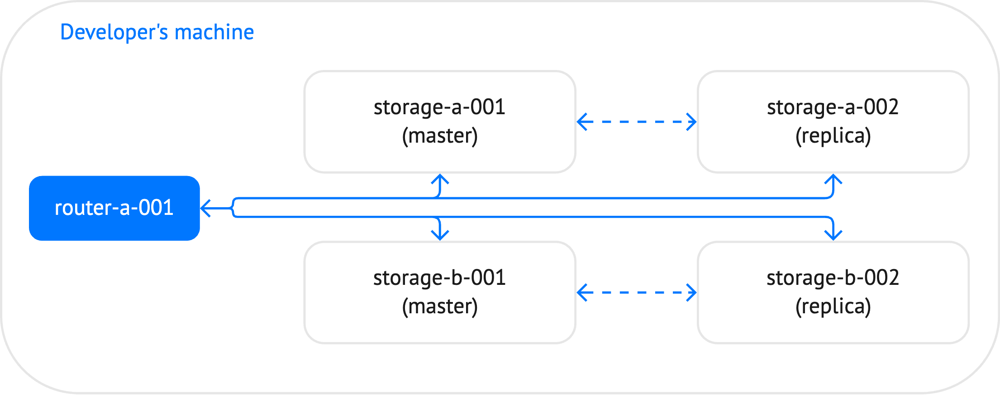

Для начала развернем кластер с шардингом, делал по [документации](https://www.tarantool.io/en/doc/latest/how-to/vshard_quick/)
Просто из директории на маке запускаться отказался, поэтому оборачиваем все в контейнер, переходим в директорию `./src`, в консоли пишем:
```shell
docker build -t tsi .
docker run --rm -it -v .:/opt/tarantool --name ts -d tsi
docker exec -it ts bash
```

В директории `./src` уже определены нужные согласно документации конфигурационные файлы.

Кластер будет устроен следующим образом:

Его элементы описаны в `instances.yaml`. Конфигурация описана в `config.yaml`. В файле `billcl-scm-1.rockspec` описаны нужные внешние зависимости (в частности нужная версия `vshard`).

В контейнере нужно инициализировать кластер, сделать директорию `~/instances.enabled/billcl` и положить туда конфигурационные файлы. Для удобства эту часть обернул в скрипт `init_cluster.sh`
```shell
#!/bin/bash
BASE_PATH=/opt/tarantool/
SRC_PATH=~/instances.enabled/billcl
cd ~
tt init
mkdir -p $SRC_PATH
cp $BASE_PATH/router.lua $SRC_PATH
cp $BASE_PATH/storage.lua $SRC_PATH
cp $BASE_PATH/config.yaml $SRC_PATH
cp $BASE_PATH/instances.yaml $SRC_PATH
cp $BASE_PATH/billcl-scm-1.rockspec $SRC_PATH
```

После этого в контейнере собираем, запускаем кластер и подключаемся к нему через роутер через команды:
```shell
tt build billcl
tt start billcl
tt connect billcl:router-a-001
```

Ура, все получилось!

```
src ) docker build -t tsi .                                                                                                                                                                             (base) 
[+] Building 1.4s (9/9) FINISHED                                                                                                                                                          docker:desktop-linux
 => [internal] load build definition from Dockerfile                                                                                                                                                      0.0s
 => => transferring dockerfile: 302B                                                                                                                                                                      0.0s
 => [internal] load .dockerignore                                                                                                                                                                         0.0s
 => => transferring context: 2B                                                                                                                                                                           0.0s
 => [internal] load metadata for docker.io/tarantool/tarantool:latest                                                                                                                                     1.3s
 => [1/5] FROM docker.io/tarantool/tarantool:latest@sha256:19c2262c0ba1e5aab86fa249cba0989c31792b0625381a72aeae7f0ba58b562b                                                                               0.0s
 => CACHED [2/5] RUN apt-get update && apt-get install -y unzip                                                                                                                                           0.0s
 => CACHED [3/5] RUN apt-get update && apt-get install -y git                                                                                                                                             0.0s
 => CACHED [4/5] RUN apt-get update && apt-get -y install cmake protobuf-compiler                                                                                                                         0.0s
 => CACHED [5/5] RUN tt rocks install expirationd                                                                                                                                                         0.0s
 => exporting to image                                                                                                                                                                                    0.0s
 => => exporting layers                                                                                                                                                                                   0.0s
 => => writing image sha256:13a3fe72439a643189b85a3da1bceedd13cdee17b2b22fb0f3cfe5bf8045ed90                                                                                                              0.0s
 => => naming to docker.io/library/tsi                                                                                                                                                                    0.0s

What's Next?
  View a summary of image vulnerabilities and recommendations → docker scout quickview
src ) docker run --rm -it -v .:/opt/tarantool --name ts -d tsi                                                                                                                                          (base) 
d658cc6f333dfc071ca4c8391c29eb77c25854c3b5791e3ca4855471d3e005d6
src ) docker exec -it ts bash                                                                                                                                                                           (base) 
root@d658cc6f333d:/opt/tarantool# chmod +x init_cluster.sh 
root@d658cc6f333d:/opt/tarantool# ./init_cluster.sh 
   • Environment config is written to 'tt.yaml'
root@d658cc6f333d:/opt/tarantool# cd ~
root@d658cc6f333d:~# tt build billcl
   • Running rocks make       
No existing manifest. Attempting to rebuild...
   • Application was successfully built
root@d658cc6f333d:~# tt start billcl
   • Starting an instance [billcl:storage-b-002]...
   • Starting an instance [billcl:router-a-001]...
   • Starting an instance [billcl:storage-a-001]...
   • Starting an instance [billcl:storage-a-002]...
   • Starting an instance [billcl:storage-b-001]...
root@d658cc6f333d:~# tt connect billcl:router-a-001 
   • Connecting to the instance...
   • Connected to billcl:router-a-001

billcl:router-a-001>
```

```shell
billcl:router-a-001> vshard.router.bootstrap(
               > )
---
- true
...
```

После инициализации у нас есть 2 хранилища и 1 роутер. Проверим статус кластера -- все хорошо:
```shell
billcl:router-a-001> vshard.router.info()
---
- replicasets:
    storage-b:
      replica:
        network_timeout: 0.5
        status: available
        uri: storage@127.0.0.1:3306
        name: storage-b-002
      bucket:
        available_rw: 500
      master:
        network_timeout: 0.5
        status: available
        uri: storage@127.0.0.1:3305
        name: storage-b-001
      name: storage-b
    storage-a:
      replica:
        network_timeout: 0.5
        status: available
        uri: storage@127.0.0.1:3304
        name: storage-a-002
      bucket:
        available_rw: 500
      master:
        network_timeout: 0.5
        status: available
        uri: storage@127.0.0.1:3303
        name: storage-a-001
      name: storage-a
  bucket:
    unreachable: 0
    available_ro: 0
    unknown: 0
    available_rw: 1000
  status: 0
  alerts: []
...

billcl:router-a-001> 
```
Заполним данными нашу базу:
```shell
billcl:router-a-001> insert_data()
---
...
```

После выполнения у нас есть 10 пользователей с разными начальными балансами и скоростями трат в секунду. Обращаться будем по `id` (порядковым номерам).
Общаемся с кластером через `router-a-001`, через функции, описанные в файле `router.lua`. Они в свою очередь дергают 2 нужные нам хранимые процедуры `` `` , описанные в `storage.lua`.
```
billcl:router-a-001> get(4)
---
- [4, 0, 0]
...
```

Этому бедняку явно нужно больше денег:
```
billcl:router-a-001> add_money(4, 1000)
---
- true
...
billcl:router-a-001> get(4)
---
- [4, 1000, 0]
...
```

Чтобы жизнь медом ему не казалось, поправим ему скорость трат:
```
billcl:router-a-001> update_spending_velocity(4, 100)
---
- true
...

billcl:router-a-001> get(4)
---
- [4, 1000, 100]
...
```
Итого, к текущему моменту, у нас есть кластер из 2 хранилищ (мастер + реплика) и роутера, с правильным шардингом. А также хранимые процедуры добавления денег на счет пользователя и изменения скорости трат в секунду.


